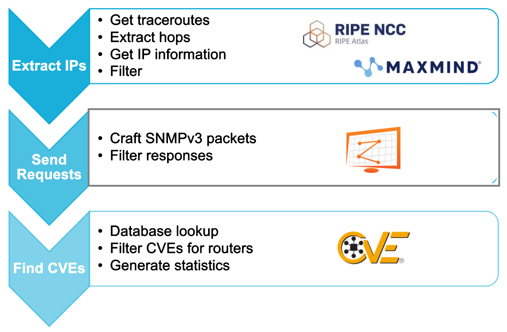

# router_fingerprinting

Collection of scripts allowing the fingerprinting of routers towards research purposes. 

Pipeline:
Collect IPs through traceroutes -> Get information about IPs (location, ASN) -> SNMP/NTP requests -> Extract information from responses -> Address resolution -> Infer whether routers are vulnerable based on uptime

Run the subprojects in this order:

1. [Traceroute IP country extractor](https://github.com/andra1782/router_fingerprinting/tree/main/traceroute-ip-country-extractor)
2. [Scanner](https://github.com/andra1782/router_fingerprinting/tree/main/scanner)
3. [CVE Finder](https://github.com/andra1782/router_fingerprinting/tree/main/cve-finder)

Note: If you want to the CVE Finder with the tags option, then you should also run the [bgp-tools helper](https://github.com/andra1782/router_fingerprinting/tree/main/bgp-tools) to extract the tags. 



## Prerequisites
```bash
pip install -r requirements.txt
```

**NOTE**: Each sub-project may also have other requirements, refer to their README-s for their installation and usage guides.
